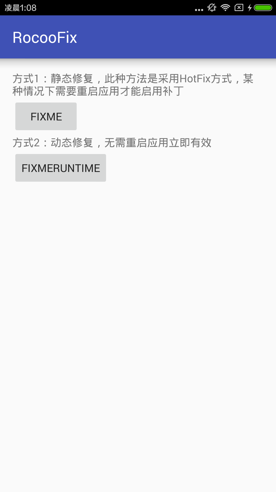
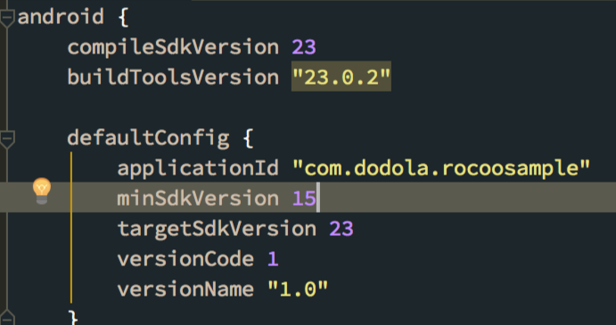
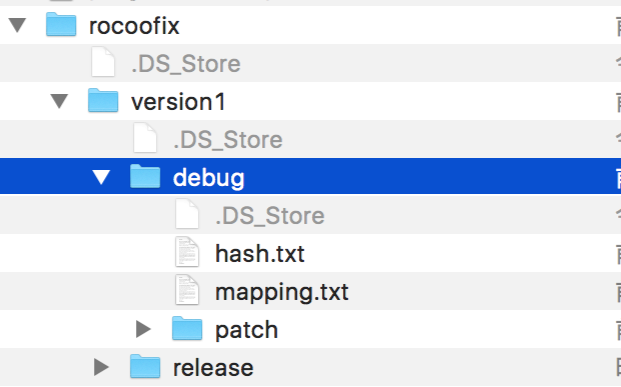
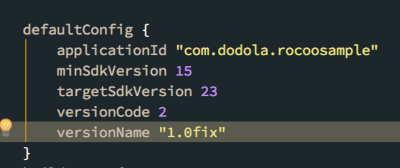
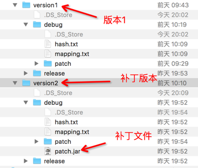
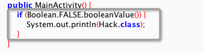

# RocooFix

Another hotfix framework

## update
新写了一个框架原理与美团robust框架类似，具体看这里:[**AnoleFix**](https://github.com/dodola/AnoleFix)

之前的HotFix项目太过简单，也有很多同学用Nuwa遇到很多问题，作者也不再修复，所以重新构建了一套工具。




## 遇到问题的同学可以看一下这里
https://github.com/shoyu666/derocoodemo


## Bugfix
1. 2016-06-26 
   * 增加了 Android N (API 24)的支持
   * 增加了关联引用的补丁制作模块，解决 ART NativeCode address 位置错误引起的崩溃问题，但是会造成包大小的增加，后期会支持微信提出的 Dexdiff 技术

## Features
* **支持两种模式**：
  1. 静态修复某种情况下需要重启应用。
  2. 动态修复，无需重启应用即可生效。
  3. 新增so修复，beta中
* **支持DalvikVM和ART VM**
* 制作补丁更加方便
* 支持`com.android.tools.build:gradle:1.3.0`->`com.android.tools.build:gradle:2.1.2` (解决了Nuwa 这个[issue][1])
* 支持混淆和Mulitdex
* 无需关注`hash.txt`和`mapping.txt`文件的生成和保存

## TODO
* 补充单测
* 兼容性测试
* 目录规则调整
* 对Win系统的支持

## Use
```java
public class RocooApplication extends Application {
    @Override
    protected void attachBaseContext(Context base) {
        super.attachBaseContext(base);
        //初始化
        RocooFix.init(this);
    }
}


//方案1：静态启用，一般在Application里加载补丁
/**
  * 从Assets里取出补丁，一般用于测试
  *
  * @param context
  * @param assetName
  */
RocooFix.initPathFromAssets(Context context, String assetName);
 /**
   * 从指定目录加载补丁
   * @param context
   * @param dexPath
   */
RocooFix.applyPatch(Context context, String dexPath);


//方案2：动态打补丁，立即生效，有性能问题，适用于补丁方法数较少的情况，建议在ART虚拟机里启用该模式
/**
 * 从Asset里加载补丁，一般用于本地测试
 * @param context
 * @param assetName
 */
RocooFix.initPathFromAssetsRuntime(Context context, String assetName) ;

/**
 * 从指定目录加载补丁
 * @param context
 * @param dexPath
 */ 
RocooFix.applyPatchRuntime(Context context, String dexPath)  ;


/**
 *  
 *  new Feature  beta 中
 * 从指定目录加载so补丁，使用so还需调用System.loadLibrary("xx")
 * @param context
 * @param soDirPath  so补丁路径(这里是dir)
 */ 
 RocooSoFix.applyPatch(Context context, String soDirPath);

```

## Configuration

1 在root的`build.gradle`增加如下内容:
```groovy
 repositories {
        jcenter()
    }
 dependencies {
        classpath 'com.dodola:rocoofix:1.2.6’
    }
```
2 在你项目的`build.gradle`文件里添加如下配置

```groovy
apply plugin: 'com.dodola.rocoofix'

repositories {
    jcenter()
}

rocoo_fix {
    includePackage = ['com/dodola/rocoosample']//指定将来可能需要制作补丁的package(就是指定插庄的范围)
    excludeClass = ['BaseApplication.class']//将不需要加到patch里的类写在这里(不需要插庄的类)
    
    preVersionPath = '1'//注意：此项属性只在需要制作补丁的时候才需开启！！如果不需要制作补丁则需要去掉此项
    
    enable = true//注意：关掉此项会无法生成Hash.txt文件
    
    scanref=true//默认为 false，开启这个选项会将与补丁 class 相引用的 class 都打入包中来解决 ART 虚拟机崩溃问题，功能 Beta 中
}

dependencies {

    compile 'com.dodola:rocoo:1.1'
}

```

这里主要介绍一下`preVersionPath`这个属性的作用。

`rocoo_fix`将制作补丁的步骤透明化，用户无需手动备份hash.txt文件，插件会自动根据当前的`versionCode`生成`hash.txt`和`mapping.txt`文件到指定目录，比如：

上一个版本发布的时候版本号是`1`，那么生成的文件会放在`app源码目录/rocooFix/version1/[debug]|[release]`的目录下，如果需要制作补丁那么在配置里指定`preVersionPath` 属性，它的值是上一个版本的版本号，这里的值是`1`，

然后将`build.gradle`的`versionCode`的号码修改，这里修改成`2`，只要和之前的版本不同就可以，没有具体值的要求


## Proguard(混淆)

```
-keep class com.dodola.rocoofix.** {*;}
-keep class com.lody.legend.** {*;}
-keepclassmembers class com.dodola.rocoosample.** {
  public <init>();//保留init,和include package保持一致
}
```

## Build Patch

下面演示一下使用项目demo生成补丁的制作过程

1 假如我们需要打补丁的文件是
```java
package com.dodola.rocoosample;

public class HelloHack {

    public String showHello() {
        return "hello world";
    }
}
```
此时`build.gradle`里的`VersionCode`是`1`


2 运行一次应用，这时会在`app`的目录下生成如下文件：



这里可以看做是我们已经发布版本的`hash.txt`


3 假设我们需要修复步骤1 里的`showHello`方法，修改如下：

```java
package com.dodola.rocoosample;

public class HelloHack {

    public String showHello() {
        return "hello Hack";//此处修复，补丁加载后该方法返回hello hack
    }
}

```

4 修改build.gradle 文件里`rocoo_fix`项，让其执行patch 的task，配置如下

```gradle
rocoo_fix {

    preVersionPath = '1'//注意：这里指定的是需要打补丁的VersionCode
    enable = true
}

```

5 修改当前项目的`versionCode`为`2`，说明这个是一个升级fix版本。



6 正常发布应用，此时会在下图所示的路径中生成补丁文件：




7 我们可以反编译apk来确认插庄是否成功



  
## 相关项目
[Legend](https://github.com/asLody/legend)


[1]:https://github.com/jasonross/Nuwa/issues/65
